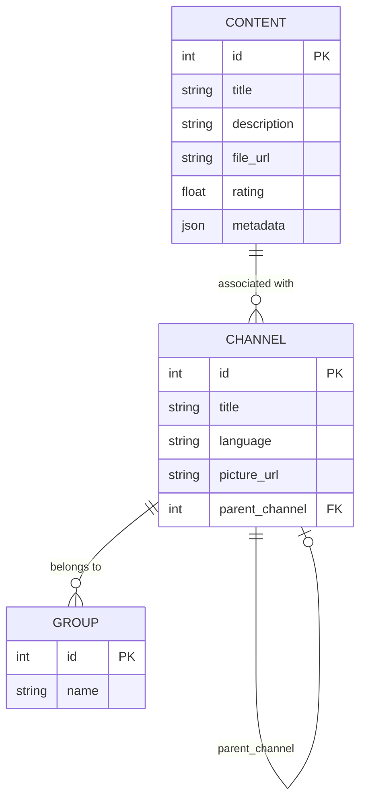

# Table Model Documentation

This document describes the structure of the database tables used in the Media Platform API. The system consists of
three main tables: `Content`, `Channel`, and `Group`. Below is a detailed explanation of each table and their
relationships.

## Tables

### 1. Content
The `Content` table stores individual pieces of media, such as videos, text, or PDFs.  
It includes metadata, file URLs, and a rating system to evaluate the quality of the content.

Columns:
- `id` (Primary Key): Unique identifier for each piece of content.
- `title`: Title of the content.
- `description`: A brief description of the content (optional).
- `file_url`: A URL pointing to the media file (optional).
- `rating`: A decimal value between 0 and 10 representing the content's rating.
- `metadata`: Arbitrary JSON data for additional details.

### 2. Channel
The `Channel` table organizes content into a hierarchical structure.  
A channel can either contain subchannels or associated content, but not both simultaneously.

Columns:
- `id` (Primary Key): Unique identifier for each channel.
- `title`: Title of the channel.
- `language`: Language code for the channel (e.g., "en" or "es").
- `picture_url`: URL to an image representing the channel (optional).
- `parent_channel` (Foreign Key): References another channel for hierarchical organization.
- Relationships:
  - Many-to-Many with `Content`: A channel can have multiple associated contents.
  - Many-to-Many with `Group`: A channel can belong to multiple groups.

### 3. Group
The `Group` table categorizes channels into logical groups.  
For example, groups can represent genres, languages, or regional categories.

Columns:
- `id` (Primary Key): Unique identifier for each group.
- `name`: Name of the group.
- Relationships:
  - Many-to-Many with `Channel`: A group can include multiple channels.

## Entity Relationship Diagram

Below is a Mermaid diagram illustrating the relationships between the `Content`, `Channel`, and `Group` tables:



## Relationships Explained

1. Content ↔ Channel:
   - A many-to-many relationship exists between Content and Channel.
   - A channel can include multiple pieces of content, and a piece of content can belong to multiple channels.
2. Channel ↔ Channel:
   - A self-referential one-to-many relationship exists between Channel and itself (parent_channel).
   - A channel can contain subchannels, creating a hierarchical structure.
3. Channel ↔ Group:
   - A many-to-many relationship exists between Channel and Group.
   - A channel can belong to multiple groups, and a group can include multiple channels.

## Example Data

### Sample Row for `Content`
| id | title        | description   | file_url              | rating | metadata                     |
|----|--------------|---------------|-----------------------|--------|------------------------------|
| 1  | "Episode 1"  | "First ep"    | "https://example.com" | 8.5    | {"genre": "comedy"}          |
| 2  | "Document 1" | "Guide PDF"   | "https://example.pdf" | 7.0    | {"author": "John Doe"}       |

---

### Sample Row for `Channel`
| id | title          | language | picture_url            | parent_channel |
|----|----------------|----------|------------------------|----------------|
| 1  | "Main Channel" | "en"     | "https://main.jpg"     | NULL           |
| 2  | "Subchannel 1" | "en"     | "https://sub1.jpg"     | 1              |
| 3  | "Subchannel 2" | "es"     | "https://sub2.jpg"     | 1              |

---

### Sample Row for `Group`
| id | name          |
|----|---------------|
| 1  | "Drama"       |
| 2  | "Comedy"      |
| 3  | "Action"      |

### Insert Example Data into the Database

You can run these commands in the Django shell to insert these example values:

- Open the Django shell:
  ```bash
  python manage.py shell
  ```
- Insert records into tables:
```Python
from media_platform.models import Content, Channel, Group

# Create Content
content1 = Content.objects.create(
    title="Episode 1",
    description="First ep",
    file_url="https://example.com",
    rating=8.5,
    metadata={"genre": "comedy"}
)

content2 = Content.objects.create(
    title="Document 1",
    description="Guide PDF",
    file_url="https://example.pdf",
    rating=7.0,
    metadata={"author": "John Doe"}
)

# Create Groups
group_drama = Group.objects.create(name="Drama")
group_comedy = Group.objects.create(name="Comedy")
group_action = Group.objects.create(name="Action")

# Create Channels
main_channel = Channel.objects.create(
    title="Main Channel",
    language="en",
    picture_url="https://main.jpg",
    parent_channel=None  # Top-level channel
)

subchannel1 = Channel.objects.create(
    title="Subchannel 1",
    language="en",
    picture_url="https://sub1.jpg",
    parent_channel=main_channel
)

subchannel2 = Channel.objects.create(
    title="Subchannel 2",
    language="es",
    picture_url="https://sub2.jpg",
    parent_channel=main_channel
)

# Associate Content with Channels
subchannel1.contents.add(content1)  # Episode 1 belongs to Subchannel 1
subchannel2.contents.add(content2)  # Document 1 belongs to Subchannel 2

# Associate Groups with Channels
subchannel1.groups.add(group_comedy, group_drama)  # Subchannel 1 belongs to multiple groups
subchannel2.groups.add(group_action)
```
- Checking data, you can see the new data on the [web](http://127.0.0.1:8000/admin/media_platform/channel/) or from the 
Django shell: 
```Python
Channel.objects.all()
subchannel1.contents.all()
main_channel.groups.all()
```
- Close the Django shell:
```Python
exit()
```